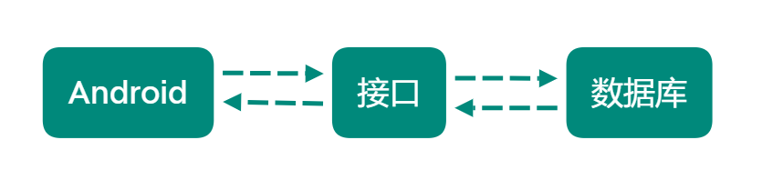

# 1-1 Android开发概述

- Android是Google开发的操作系统
- Android开发是移动应用开发的表现形式之一

完整项目最精简流程：

# 1-2 Android开发工具

**Android Studio**

Android Studio是Google自己推出的Android集成开发工具

# 1-3 第一个Android应用

Hello World

项目目录与文件的简单了解

实现第一个最简单的APP：Hello World！