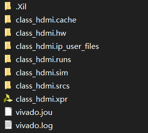
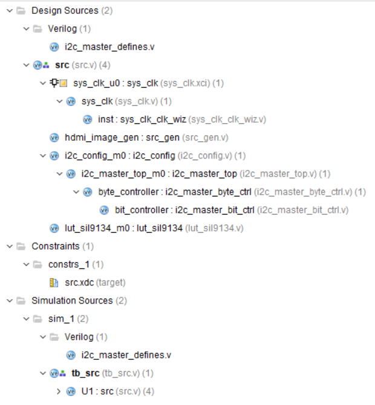

# FPGA课程 HDMI 文档

## 文件目录结构

将`class_hdmi.zip`文件解压即可得到`class_hdmi`文件夹：

- `class_hdmi.cache`：Vivado软件的临时缓存文件。
- `class_hdmi.hw`：此目录中是存放硬件信息的，包括使用器件和综合后的网表，同时ila的波形调试结果也在此目录中存储。
- `class_hdmi.ip_user_files`：用户关于 IP 的文件。
- `class_hdmi.runs`：内部有许多名为(name)_synth_n和(name)_imp_n形式的文件夹，里面是综合和布局布线生成的一些临时文件，对于主模块，其(name)为空，里面生成的文件中包含报告文件和bit流。
- `class_hdmi.sim`：仿真过程文件和仿真波形，结果等。
- `class_hdmi.srcs`：项目源文件目录，里面又分文sources_n, sim_n,和constrs_n而sources_n和sim_n内又分为import和new，顾名思义，源文件和仿真文件被分离开，但源文件实际上也是参与仿真的，sources_n下属子目录的子目录中除了自己新建的设计文件，又可以分为ip、bd等,ip目录下是ip核生成的文件，bd则是vivado专用图形设计界面的文件（bd的创建和文件解析将会在后面的教程中说到），sim_n内的文件通常是test bench，constrs_n内是XDC约束文件，用于时序约束和引脚约束等。此外，如果使用了ip，将可能生成ipshare目录，此目录中存放了一些保存被引用ip的一个临时副本。
- `class_hdmi.xpr`：Vivado 工程启动文件。

直接双击打开`class_hdmi.xpr`即可进入工程。

## 项目工程目录结构

打开项目工程后的目录结构如下：

- `src`：顶层组织实例化模块
- `sys_clk`：时钟模块
- `src_gen`：图像生成模块
- `i2c_config`：I2C配置模块
- `lut_sil9134`：实例化查找表
- `tb_src`：功能仿真模块
- `sec.xdc`：管脚约束文件

## 实现的功能

各种输出效果的实现在文件`src_gen.v`文件中，通过修改部分代码可实现不同输出效果，目前包括：

- HDMI任意颜色纯色输出
- HDMI输出彩条
	- 可任意改变任意彩条的颜色与宽度
- HDMI输出动态循环的横条纹与竖条纹
	- 可任意改变条纹的宽度与动态速度
- HDMI输出斜条纹
	- 可任意改变条纹的宽度与动态速度

> 纯色输出与彩条输出代码已被注释，目前的代码实现的是横条纹、竖条纹、斜条纹的一起循环动态运动。
>
> 想要实现纯色或彩条输出只需将动态条纹代码注释，并将想要的功能解除注释，重新进行综合即可实现。