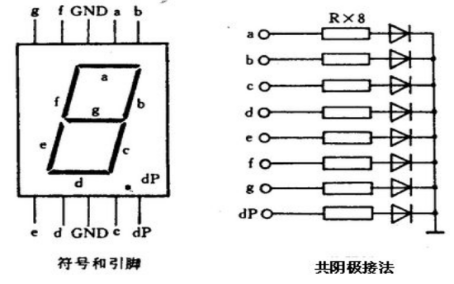
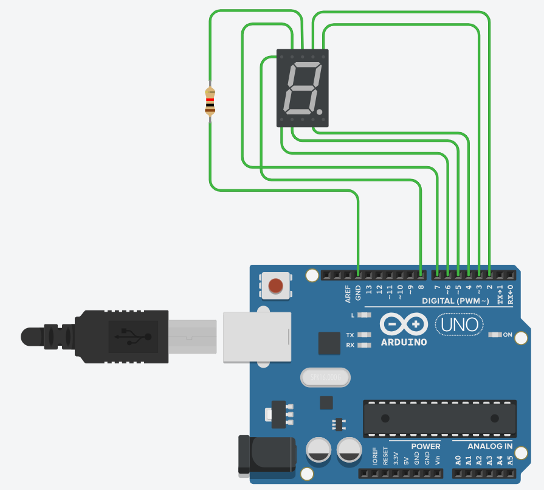

# 作业-数码管数字显示

七段数码管共阴接线图：



线路连接图：



代码实现：

```c
void setup()
{
    Serial.begin(9600);
    pinMode(2, OUTPUT);
    pinMode(3, OUTPUT);
    pinMode(4, OUTPUT);
    pinMode(5, OUTPUT);
    pinMode(6, OUTPUT);
    pinMode(7, OUTPUT);
    pinMode(8, OUTPUT);
}

void loop()
{
    int num;
    num = Serial.read() - '0';
    if (num == 0)
    {
        digitalWrite(2, HIGH);
        digitalWrite(3, HIGH);
        digitalWrite(4, HIGH);
        digitalWrite(5, HIGH);
        digitalWrite(6, HIGH);
        digitalWrite(7, HIGH);
        digitalWrite(8, LOW);
    }
    else if (num == 1)
    {
        digitalWrite(2, LOW);
        digitalWrite(3, HIGH);
        digitalWrite(4, HIGH);
        digitalWrite(5, LOW);
        digitalWrite(6, LOW);
        digitalWrite(7, LOW);
        digitalWrite(8, LOW);
    }
    else if (num == 2)
    {
        digitalWrite(2, HIGH);
        digitalWrite(3, HIGH);
        digitalWrite(4, LOW);
        digitalWrite(5, HIGH);
        digitalWrite(6, HIGH);
        digitalWrite(7, LOW);
        digitalWrite(8, HIGH);
    }
    else if (num == 3)
    {
        digitalWrite(2, HIGH);
        digitalWrite(3, HIGH);
        digitalWrite(4, HIGH);
        digitalWrite(5, HIGH);
        digitalWrite(6, LOW);
        digitalWrite(7, LOW);
        digitalWrite(8, HIGH);
    }
    else if (num == 4)
    {
        digitalWrite(2, LOW);
        digitalWrite(3, HIGH);
        digitalWrite(4, HIGH);
        digitalWrite(5, LOW);
        digitalWrite(6, LOW);
        digitalWrite(7, HIGH);
        digitalWrite(8, HIGH);
    }
    else if (num == 5)
    {
        digitalWrite(2, HIGH);
        digitalWrite(3, LOW);
        digitalWrite(4, HIGH);
        digitalWrite(5, HIGH);
        digitalWrite(6, LOW);
        digitalWrite(7, HIGH);
        digitalWrite(8, HIGH);
    }
    else if (num == 6)
    {
        digitalWrite(2, HIGH);
        digitalWrite(3, LOW);
        digitalWrite(4, HIGH);
        digitalWrite(5, HIGH);
        digitalWrite(6, HIGH);
        digitalWrite(7, HIGH);
        digitalWrite(8, HIGH);
    }
    else if (num == 7)
    {
        digitalWrite(2, HIGH);
        digitalWrite(3, HIGH);
        digitalWrite(4, HIGH);
        digitalWrite(5, LOW);
        digitalWrite(6, LOW);
        digitalWrite(7, LOW);
        digitalWrite(8, LOW);
    }
    else if (num == 8)
    {
        digitalWrite(2, HIGH);
        digitalWrite(3, HIGH);
        digitalWrite(4, HIGH);
        digitalWrite(5, HIGH);
        digitalWrite(6, HIGH);
        digitalWrite(7, HIGH);
        digitalWrite(8, HIGH);
    }
    else if (num == 9)
    {
        digitalWrite(2, HIGH);
        digitalWrite(3, HIGH);
        digitalWrite(4, HIGH);
        digitalWrite(5, HIGH);
        digitalWrite(6, LOW);
        digitalWrite(7, HIGH);
        digitalWrite(8, HIGH);
    }
}
```

### 用if else语句来写这个程序会非常繁琐，可以试着寻找代码上的改进方法。

### 可以用switch case语句来提高程序的简洁性：

```c
void setup()
{
    Serial.begin(9600);
    pinMode(2, OUTPUT);
    pinMode(3, OUTPUT);
    pinMode(4, OUTPUT);
    pinMode(5, OUTPUT);
    pinMode(6, OUTPUT);
    pinMode(7, OUTPUT);
    pinMode(8, OUTPUT);
}

void loop()
{
    int num;
    num = Serial.read() - '0';
    switch (num) {
    case 0:
        digitalWrite(2, HIGH);
        digitalWrite(3, HIGH);
        digitalWrite(4, HIGH);
        digitalWrite(5, HIGH);
        digitalWrite(6, HIGH);
        digitalWrite(7, HIGH);
        digitalWrite(8, LOW);
        break;
    case 1:
        digitalWrite(2, LOW);
        digitalWrite(3, HIGH);
        digitalWrite(4, HIGH);
        digitalWrite(5, LOW);
        digitalWrite(6, LOW);
        digitalWrite(7, LOW);
        digitalWrite(8, LOW);
        break;
    case 2:
        digitalWrite(2, HIGH);
        digitalWrite(3, HIGH);
        digitalWrite(4, LOW);
        digitalWrite(5, HIGH);
        digitalWrite(6, HIGH);
        digitalWrite(7, LOW);
        digitalWrite(8, HIGH);
        break;
    case 3:
        digitalWrite(2, HIGH);
        digitalWrite(3, HIGH);
        digitalWrite(4, HIGH);
        digitalWrite(5, HIGH);
        digitalWrite(6, LOW);
        digitalWrite(7, LOW);
        digitalWrite(8, HIGH);
        break;
    case 4:
        digitalWrite(2, LOW);
        digitalWrite(3, HIGH);
        digitalWrite(4, HIGH);
        digitalWrite(5, LOW);
        digitalWrite(6, LOW);
        digitalWrite(7, HIGH);
        digitalWrite(8, HIGH);
        break;
    case 5:
        digitalWrite(2, HIGH);
        digitalWrite(3, LOW);
        digitalWrite(4, HIGH);
        digitalWrite(5, HIGH);
        digitalWrite(6, LOW);
        digitalWrite(7, HIGH);
        digitalWrite(8, HIGH);
        break;
    case 6:
        digitalWrite(2, HIGH);
        digitalWrite(3, LOW);
        digitalWrite(4, HIGH);
        digitalWrite(5, HIGH);
        digitalWrite(6, HIGH);
        digitalWrite(7, HIGH);
        digitalWrite(8, HIGH);
        break;
    case 7:
        digitalWrite(2, HIGH);
        digitalWrite(3, HIGH);
        digitalWrite(4, HIGH);
        digitalWrite(5, LOW);
        digitalWrite(6, LOW);
        digitalWrite(7, LOW);
        digitalWrite(8, LOW);
        break;
    case 8:
        digitalWrite(2, HIGH);
        digitalWrite(3, HIGH);
        digitalWrite(4, HIGH);
        digitalWrite(5, HIGH);
        digitalWrite(6, HIGH);
        digitalWrite(7, HIGH);
        digitalWrite(8, HIGH);
        break;
    case 9:
        digitalWrite(2, HIGH);
        digitalWrite(3, HIGH);
        digitalWrite(4, HIGH);
        digitalWrite(5, HIGH);
        digitalWrite(6, LOW);
        digitalWrite(7, HIGH);
        digitalWrite(8, HIGH);
        break;
    }
}
```

