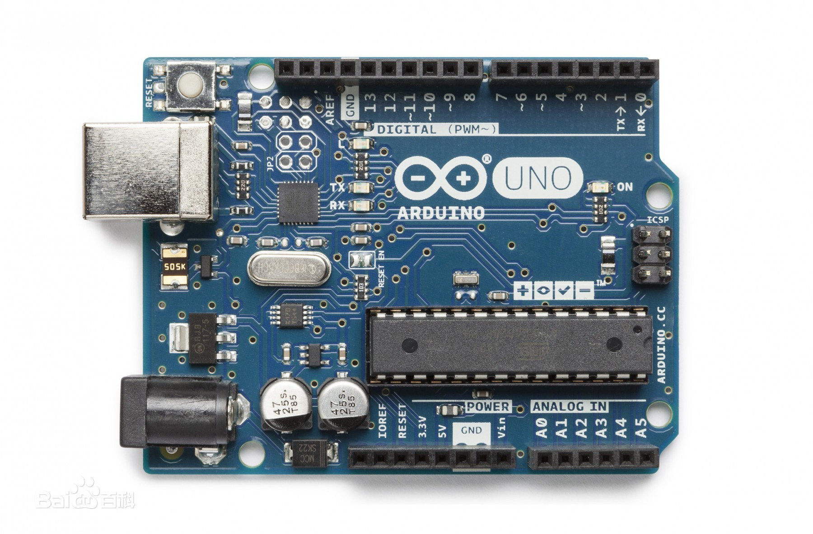
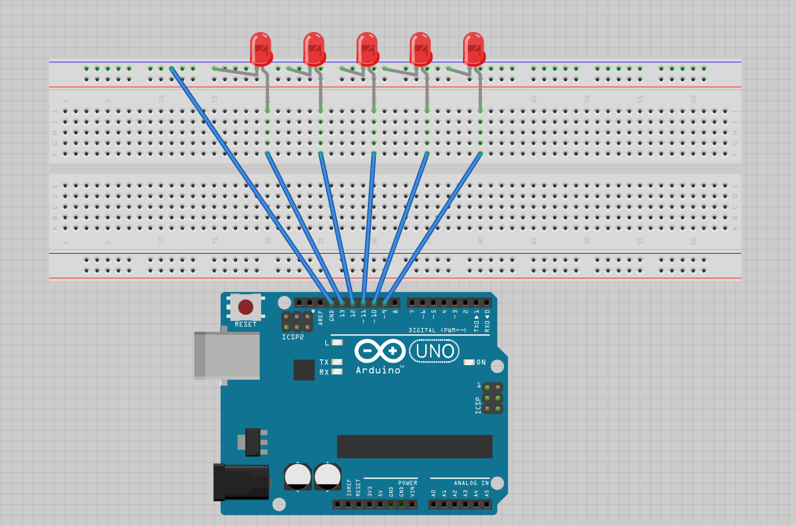
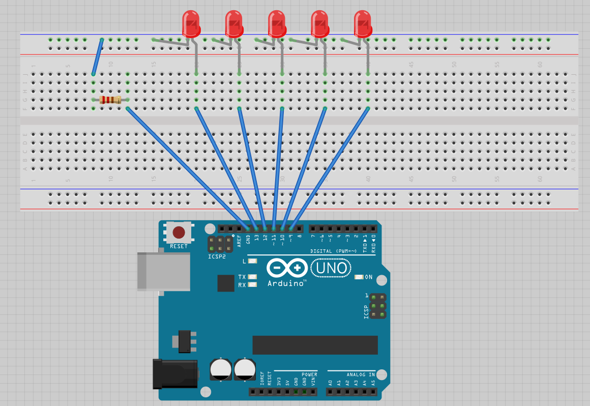

# 双创周《开源硬件实战》课程笔记（2）

## 1.作业问题

**作业一定要认真完成，按时提交。**

## 2.认识Arduino

### （1）板子



### （2）Arduino软件（Arduino IDE）

**用于编写和烧录Arduino程序。**

### （3）环境

①fritzing

②Tinkercad  ：www.tinkercad.com

## 3.实例

### 实现跑马灯

连接图



代码实现

```c
int i = 13;
void setup() {
  pinMode(9, OUTPUT);
  pinMode(10, OUTPUT);
  pinMode(11, OUTPUT);
  pinMode(12, OUTPUT);
  pinMode(13, OUTPUT);
}
void loop() {
  for(i = 13; i >= 9; i--)
  {
    digitalWrite(i, HIGH);
    delay(500);
    digitalWrite(i, LOW);
    delay(500);
  }
}
```

改进如图：由于LED灯需要的电流比较小，电流过大有可能会烧坏LED，所以可以在电路中加一个电阻，以保护LED灯。



## 4.Arduino与PC互动

### （1）串口与并口

​		同样脉冲下，并口速度更快。但距离长的时候，并口由于线路较多，容易被干扰，不稳定。

​		USB是串口，而且频率特别高。

​		单片机一般用串口通信，用于调试目标设备。

### （2）串口通信

```c
Serial.begin(9600);  //设置通信率
Serial.read();   //读取串口窗口中输入的数据
Serial.println(distance);  //在串口窗口中输出数据
//其余更多的函数可以参考官网函数手册。
```

# 自学单个数码管的使用，实现在上面显示串口窗口输入的数字（0- 8）		提交程序


