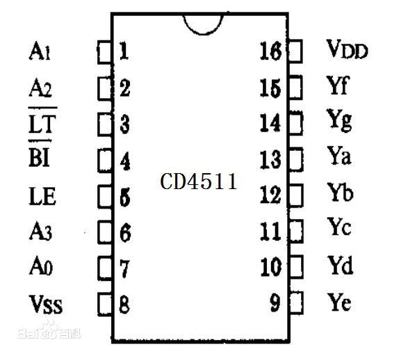

# CD4511的应用

**电路图：**

**原理图：**

A0~A3：二进制数据输入端

/BI：输出消隐控制端

LE：数据锁定控制端

/LT：灯测试端

Ya~Yg：数据输出端

VDD：电源正

VSS：接地

**真值表：**

**引脚的使用：**

1.其中a b c d 为 BCD 码输入，a为最低位。

2.LT为灯测试端，加高电平时，显示器正常显示，加低电平时，显示器一直显示数码“8”，各笔段都被点亮，以检查显示器是否有故障。

3.BI为消隐功能端，低电平时使所有笔段均消隐，正常显示时， B1端应加高电平。

4.CD4511有拒绝伪码的特点，当输入数据越过十进制数9(1001)时，显示字形也自行消隐。

5.LE是锁存控制端，高电平时锁存，低电平时传输数据。

**注意：**

1.要将数码管设置为“共阴”

2.注意四位输入中 “a” （对应拨码开关的”1“）为最低位，如要输出“1”，则输入为“1000”，要输出”3“，则输入为”1010“。

可以将 ”a b c d“ 与拨码开关的 ”1 2 3 4“ 反接一下，如图：

这样的话，就是”a“（对应拨码开关的”4“）为最低位，如要输出“1”，则输入为“0001”，要输出”3“，则输入为”0101“。这样就比较符合习惯。

3.注意单个数码管只能输出0 - 9，但四位编码器可以输出16个数字（0 - 15），因此”10“以后的数字在数码管上就无法显示，直接就不显示，显示为”消隐“。

4.注意拨码开关靠近”ON“的四个引脚连接电源的正极，不然默认状态下就是全为”1“。

5.CD4511驱动数码管的数字”6“和”9“显示有问题，和正常显示的略有不同，可以参考下图来改进电路：

