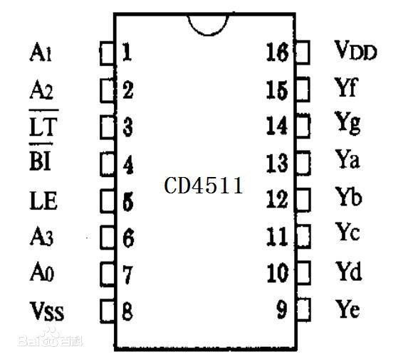
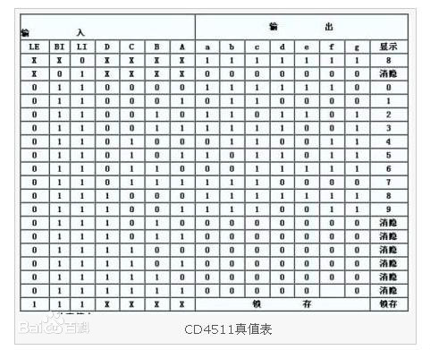
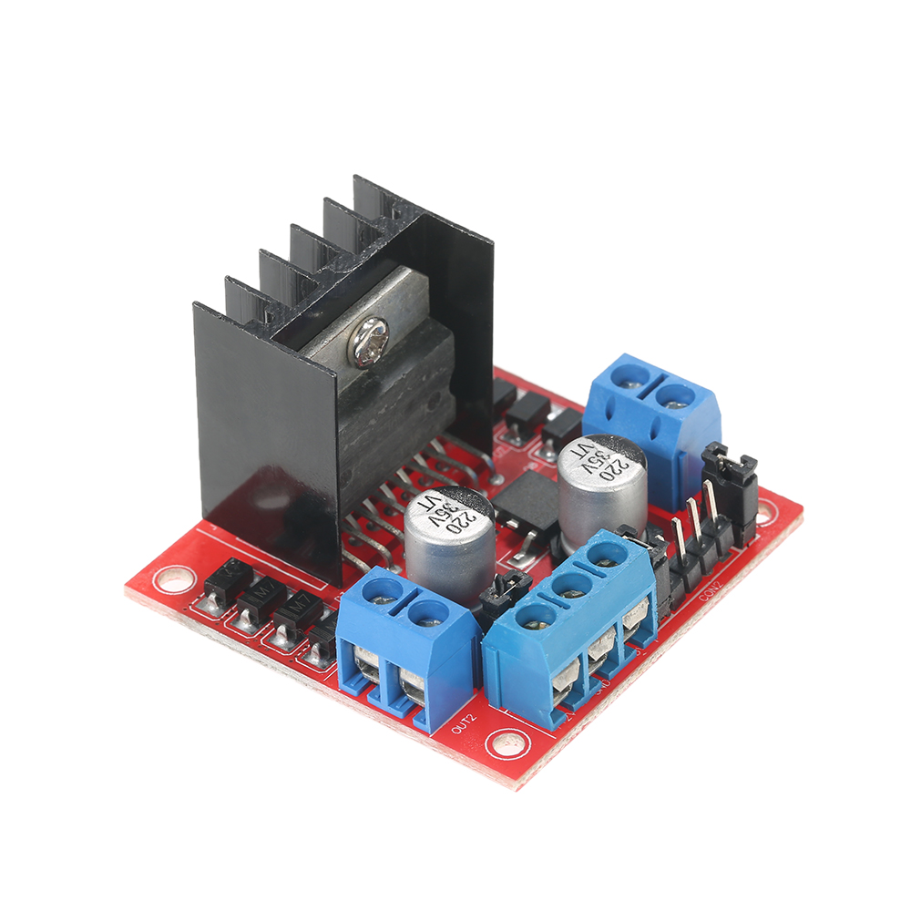

# 双创周《开源硬件实战》课程笔记（3）

## 1. 数码管显示数字

（1）算法提升：

可以用表驱动法，将一个真值表用数组写在程序中，简化程序。

（2）硬件辅助（CD4511）:

CD4511 是一片 CMOS BCD—锁存/7 段译码/驱动器，用于驱动共阴极 LED （数码管）显示器的 BCD 码-七段码译码器。具有BCD转换、消隐和锁存控制、七段译码及驱动功能的CMOS电路能提供较大的拉电流。可直接驱动共阴LED数码管。



引脚功能:

A0~A3：二进制数据输入端
/BI：输出消隐控制端
LE：数据锁定控制端
/LT：灯测试端
Ya~Yg：数据输出端
VDD：电源正
VSS：接地

CD4511真值表:



**CD4511的应用参照：[CD4511的应用](CD4511应用.md)**

##  2.C语言位运算

~  取反

&  位与

|   位或

﹥﹥右移（除以2）

﹤﹤  左移（乘以2）

^  异或

## 3.控制电机

L29系列：驱动电路

如L293D， L298N等

L298N：



## 4.封装库的方法

例子：摩尔斯电码库（串口输入字符，通过光信号，声音信号或电信号输出）

如果要输出A，则要让LED灯输出“  .  -  ”,要设置两个符号（ . 和 - ）之间的间隔和两个字符（A和下一个字符的间隔）之间的间隔

这样写太过麻烦，可以写几个函数，分别代表 点，横线，小间隔，大间隔。

如函数代码：

```c
#define SHORT 100
#define LONG 500
#define PIN 13		//此处用宏定义比较方便
void dot()	//一个点符号
{
    digitalWrite(PIN, HIGH);
    delay(SHORT);
    digitalWrite(PIN, LOW);
    delay(SHORT);	//要实现字符间隔，则直接加一个长停顿即可（把两个符号的停顿集成进每一个符号）
}
void line()	//一个短横线符号
{
    digitalWrite(PIN, HIGH);
    delay(LONG);
    digitalWrite(PIN, LOW);
    delay(SHORT);
}
void pause()	//两个字符之间的间隔（A和下一个字符的间隔）
{
    delay(LONG); 
}
```

（1）创建三个文件：

main.cpp（主函数）     morse.cpp（库的源代码）     morse.h（头文件）

（2）写代码

morse.cpp 文件：

```c++
class XDmorse
{
	//属性
    //方法 
    //1.接收字符
    //2.输出为morse电码
}
```

